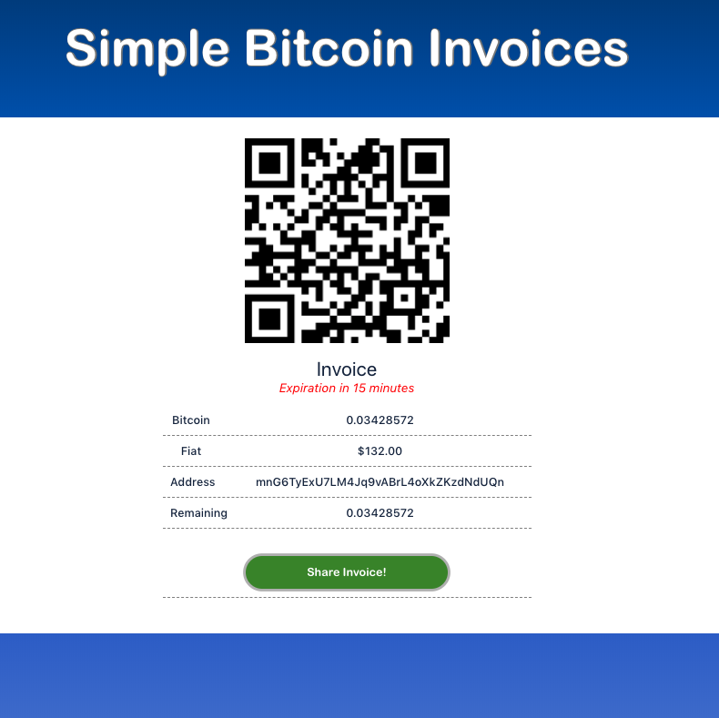

## Simple Bitcoin Invoice
##### Only for Testnet

## Components
* gRPC backend written in Go. Maintains api, invoice ledger, and key derivation.
* Envoy proxy service for protocol buffer messaging.
* Btcd bitcoin node implemenation by BtcSuite for indexing blockchain. Maintains communication with backend using websockets with TLS.
* BtcWallet golang wallet implementation by BtcSuite for maintaing balance ledger. Communication with websockets with TLS.
* Btcctl for manual testing over cli.
* Client is ReactJS frontend for issuing and viewing invoices.

## Technologies Used
* Go for backend.
* ReactJS for frontend.
* Protocol Buffers for messaging.
* Docker for deployment.

## Implementation Decisions
grpc server can stand alone as a backend to the frontend or for other clients.
Responsive UI.

## Run
```make deploy```

Tests for server can be run with <br>
```make test```

##### Includes dummy keys and certificates. Use Btcd's gencerts service to generate new keys for services.

## Manual Testing
Enter the btcd image and use btcctl to interact with regression test.
```docker exec -it <btcd_image> bash```
```btcctl --testnet --rpcuser=user --rpcpass=password --rpccert=/root/.btcwallet/rpc.cert --rpcserver=btcwallet:18332 --wallet walletpassphrase test 10000```
```btcctl --testnet --rpcuser=user --rpcpass=password --rpccert=/root/.btcd/rpc.cert --rpcserver=btcwallet:18332 generate 101```
```btcctl --testnet  --rpcuser=user --rpcpass=password --rpccert=/root/.btcwallet/rpc.cert --rpcserver=btcwallet:18332  sendtoaddress <addy> <amount>```
To list more options:
```btcctl --testnet --rpcuser=user --rpcpass=password --rpccert=/root/.btcd/rpc.cert --rpcserver=btcwallet:18332 -l```

## TODO
* Configuration file for backend that configures extended public key, confirmation policy, network configuration.
* Frontend testing.
* Certificate exchange for TLS websocket communication for bitcoin nodes and backend.
* Persistent memory for wallet.db and backend invoice ledger.
* Better understanding of situation when invoices are overpaid.
* Prevent payee from maliciously sending smaller inputs that can become unspendable.
* With the design, pretty straightforward to support alt coins.
* Endpoint that allows merchant to request derivation paths of invoices.
* Description fields for invoices.

## Example

<br>


